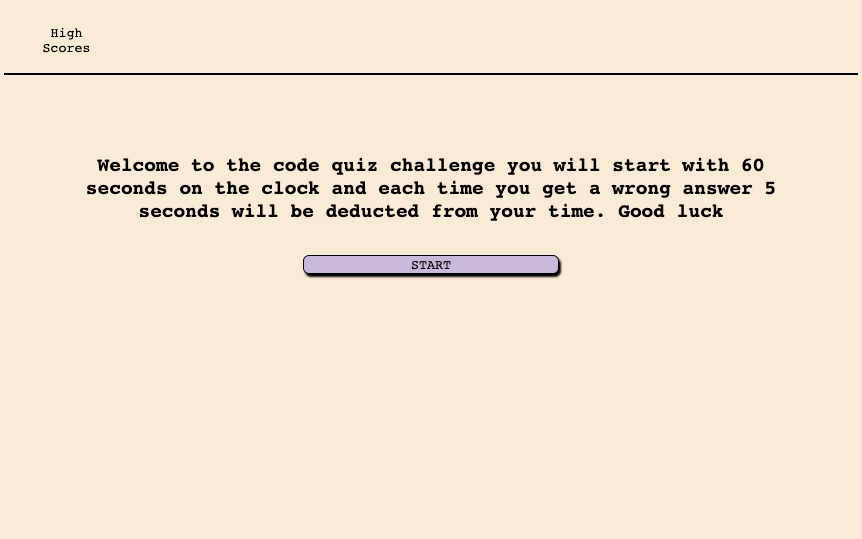
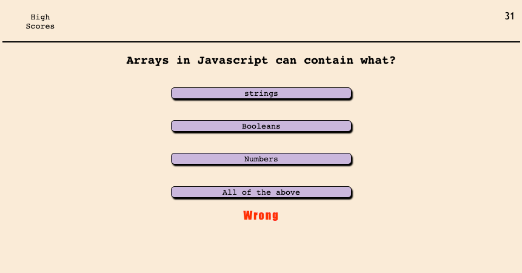

# Timed Quiz App

## Desription

-As a user I want a timed quiz based on the information learned during a fullstack bootcamp

-As a user I want open the app see a brief discription and a start button to begin the quiz.  Once the quiz has begun I want the question to display on top followed by a choice of 4 answers in buttons. I also want a 60 second timer to begin.  If I get the right answer I want the app to move to the next question and tell me it was correct. If I get the answer wrong I want to move to the next question be informed that the answer was wrong and dedect 5 seconds from the timer. When there are no questions left or the timer has run out you will be taken to a screen that shows your score and asks you to input your initials. When you submit your initials you are taken to the high score screen where your score will be printed to screen next to your initials.  If there are previous high scores they will be there as well in decsending order from highest score to lowest. If you want to play again there is a button for that.

-This was built from the ground up.  The basic structure of the app was built with HTML.  The styling is done through a linked CSS file with a little help from javascript.  And all the interactive elements and functions are in a linked javascript file, using functionality such as JSON, arrays, localStorage, timers, functions, event listeners and more.

-I created an array to hold the questions and answers and the key for the correct question.

-I used a hide class to add and remove the elements of diffrent "pages".

-This ended up being a fairly complex project using everything I have learned in the course as well as a lot of things that I had to personaly research.

-I did not make it look exacly like the mock-up. I find that what I put together makes more sense astheticly and is more scalable than the example given, and I hope it just looks a little nicer.

## Acceptence requirments:

GIVEN I am taking a code quiz

WHEN I click the start button
THEN a timer starts and I am presented with a question✅

WHEN I answer a question
THEN I am presented with another question✅

WHEN I answer a question incorrectly
THEN time is subtracted from the clock✅

WHEN all questions are answered or the timer reaches 0
THEN the game is over✅

WHEN the game is over
THEN I can save my initials and score✅

## Installation

follow this link to checkout the finished page https://taylorgehrts.github.io/Taylors_code_quiz/

## Usage

-To use the quiz app follow the link above. Then click start to begin the quiz. 

-Click buttons to answer questions

-Good Luck

## ScreenShots

## Credits

Mdn and w3schools - technical resource

StackOverflow - technical resources

Course activities - technical resources and examples to help point me in the right direction

Taylor Gehrts - all code is original, no copy and paste from other resources

